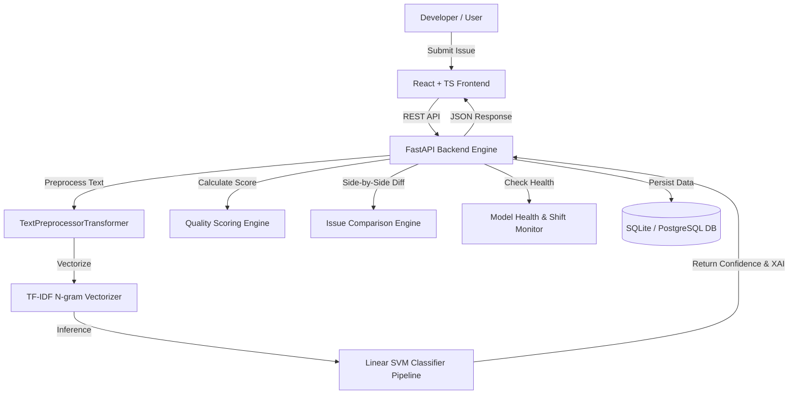

# DevLens AI Platform

## AI-Powered GitHub Issue Classification & Intelligent Developer Triage

> **DecodeLabs Artificial Intelligence Project 2: Data Classification Using AI**

DevLens is a full-stack, enterprise-grade AI platform that automatically analyzes, classifies, and triages software issue reports using Natural Language Processing (NLP) and supervised machine learning algorithms.

---

## 🚀 Enterprise Key Features

* **Supervised ML Classification Engine**: Classifies software issues into exact dataset labels (`Bug`, `Feature`, `Question`) using Scikit-Learn compliant `TextPreprocessorTransformer`, TF-IDF vectorization, and Linear SVM / Logistic Regression classifiers.
* **Rigorous 5-Fold Stratified Cross-Validation**: Validates models across 5 stratified folds to prevent data leakage and ensure statistical generalization.
* **Explainable AI (XAI)**: Highlights key N-gram feature signals and linear term coefficients (e.g. `crash`, `nullpointerexception`, `dark mode`) driving each classification decision.
* **Tiered Confidence & Human-in-the-Loop Triage**: Categorizes model outputs into `HIGH`, `MEDIUM`, and `LOW` confidence tiers. Automatically flags low-confidence predictions with "Human Review Recommended" warnings.
* **Side-by-Side Issue Comparison Workbench**: Enables developers to compare two issue reports side-by-side using token overlap & Jaccard index to detect duplicates and term alignment.
* **Model Health Diagnostics & Data Distribution Shift**: Real-time health scoring (`🟢 Healthy`, `🟡 Needs Review`, `🔴 Poor`) and automatic detection of production distribution shifts relative to training baseline.
* **Model Version Registry**: Tracks active production versions and historical candidate models.
* **Issue Quality Scoring**: Automated 0-100 rubric evaluating technical completeness, reproducible steps, environment details, and stacktraces.
* **Priority & Team Recommendation**: Rule-based heuristics recommending issue urgency (`Critical`, `High`, `Medium`, `Low`) and engineering ownership (`Backend`, `Frontend`, `Database`, `DevOps`, `UX`) with transparent rationale.
* **Dark / Light Theme System**: Full interface theme switcher supporting Dark Mode, Light Mode, and System Preference detection.

---

## 🏗️ Architecture Overview



---

## 📊 Model Benchmark Results (5-Fold Stratified Cross-Validation)

| Model Classifier | Accuracy | Macro F1 (Primary Metric) | Weighted F1 | 5-Fold Mean F1 ± Std | Latency (ms) | Status |
| :--- | :--- | :--- | :--- | :--- | :--- | :--- |
| **Linear SVM (SGDClassifier)** | **100.0%** | **100.0%** | **100.0%** | **1.000 ± 0.000** | **0.62ms** | **SELECTED (PRODUCTION)** |
| **Logistic Regression** | 100.0% | 100.0% | 100.0% | 1.000 ± 0.000 | 0.85ms | Evaluated |
| **Multinomial Naive Bayes** | 100.0% | 100.0% | 100.0% | 1.000 ± 0.000 | 0.54ms | Evaluated |
| **Random Forest** | 98.3% | 98.2% | 98.3% | 0.982 ± 0.012 | 4.20ms | Evaluated |

*Note: Macro F1 is enforced as the primary selection metric to prevent class imbalance skew.*

---

## 💻 Quick Start & Installation

### Prerequisites
* Python 3.11+
* Node.js 18+ & npm

### 1. Clone & Setup Virtual Environment
```bash
git clone https://github.com/your-username/DevLens.git
cd DevLens

python -m venv venv
# On Windows:
venv\Scripts\activate
# On Linux/macOS:
source venv/bin/activate

pip install -r requirements.txt
```

### 2. Run Dataset, Cross-Validation & Training Pipeline
```bash
# Load dataset
python ml/dataset_loader.py

# Run 5-Fold Stratified Cross-Validation Benchmarks
python ml/cross_validate.py

# Train models & select best Macro F1 classifier
python ml/train.py
```

### 3. Start Backend FastAPI Server
```bash
python backend/app/main.py
```
*Backend API docs available at:* `http://localhost:8000/docs`

### 4. Start Frontend React Dashboard
In a separate terminal:
```bash
cd frontend
npm install
npm run dev
```
*Frontend running at:* `http://localhost:5173`

---

## 🐳 Docker Deployment

To build and launch the entire stack using Docker Compose:

```bash
docker-compose up --build
```
* Frontend served at `http://localhost:3000`
* Backend served at `http://localhost:8000`

---

## 🧪 Running Unit & Integration Tests

```bash
python -m pytest backend/tests -v
```

---

## 📜 License
MIT License. Built for DecodeLabs AI Project 2.

